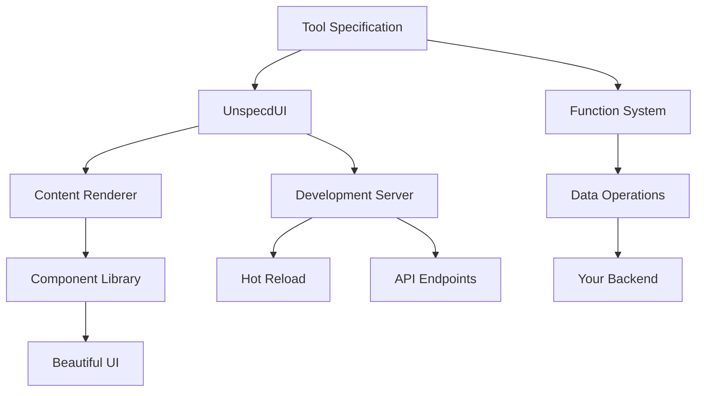

# What is Unspec'd?

Unspec'd is a **declarative UI framework** designed specifically for building internal tools, admin dashboards, and data management interfaces with minimal code and maximum productivity.

## The Problem

Building internal tools is repetitive and time-consuming:

- **CRUD interfaces** look the same but require custom implementation every time
- **Data tables, forms, and dashboards** need constant rebuilding from scratch  
- **TypeScript integration** often requires complex setup and boilerplate
- **Team collaboration** suffers when tools are scattered across different codebases
- **Rapid prototyping** is slow due to UI complexity

## The Solution

Unspec'd eliminates this friction with a **specification-driven approach**:

```typescript
// Define what you want, not how to build it
const userTool = {
  id: 'user-management',
  title: 'User Management',
  content: {
    type: 'editableTable',
    columns: {
      name: { type: 'text', label: 'Full Name' },
      email: { type: 'email', label: 'Email' },
      role: { type: 'select', options: [...] }
    }
  },
  functions: {
    loadData: async () => fetchUsers(),
    updateUser: async (data) => saveUser(data)
  }
};
```

That's it! You get a fully functional, beautiful interface with:
- ✅ **Data loading and editing**
- ✅ **Form validation**
- ✅ **Responsive design**
- ✅ **Error handling**
- ✅ **TypeScript safety**

## Key Principles

### 🎯 **Declarative Over Imperative**
Describe *what* your interface should do, not *how* to build it. Unspec'd handles the implementation details.

### ⚡ **Speed Over Flexibility**
Optimized for rapid development of common patterns. Perfect for internal tools where speed matters more than pixel-perfect customization.

### 🔧 **TypeScript First**
Built with TypeScript from the ground up. Full type safety, intelligent autocomplete, and compile-time error checking.

### 📊 **Data-Driven**
Designed around common data operations: display, edit, validate, and stream. Perfect for admin panels and dashboards.

## Core Concepts

### **Tool Specifications**
Everything in Unspec'd is defined as a "tool" - a self-contained specification that describes:
- **Identity**: Unique ID and display title
- **Content**: What type of interface to render
- **Functions**: Backend logic for data operations
- **Inputs**: Optional configuration parameters

### **Content Types**
Pre-built, production-ready components:
- **`displayRecord`**: Show single records with formatted fields
- **`editableTable`**: Full CRUD operations with inline editing
- **`editForm`**: Single-record editing with validation
- **`actionButton`**: Custom actions and workflows
- **`streamingTable`**: Real-time data with live updates

### **Function System**
Your backend logic, called automatically by the UI:
- **Data Loaders**: Fetch and format data
- **Validators**: Check input before saving
- **Actions**: Custom business logic
- **Streaming**: Real-time data feeds

## Two Modes of Operation

### **CLI Mode** - Perfect for Teams
```bash
# Initialize project
npx @glyphtek/unspecd init

# Auto-discover and run all tools
npx @glyphtek/unspecd dev

# Focus on single tool
npx @glyphtek/unspecd exec my-tool.ts
```

**Benefits:**
- **Auto-discovery**: Finds all `.tool.ts` files automatically
- **Team sharing**: Copy commands to share tools instantly
- **Hot reload**: Changes appear immediately
- **Zero config**: Works out of the box

### **Library Mode** - Perfect for Apps
```typescript
import { UnspecdUI, startServer } from '@glyphtek/unspecd';

const app = new UnspecdUI({ tools: [userTool, orderTool] });
await startServer(app);
```

**Benefits:**
- **Embedded**: Integrate into existing applications
- **Programmatic**: Full control over tool loading
- **Custom server**: Use your own hosting setup
- **API integration**: Connect to existing backends

## When to Use Unspec'd

### ✅ **Perfect For:**
- **Admin dashboards** and internal tools
- **Data management** interfaces
- **CRUD applications** with standard patterns
- **Rapid prototyping** of business tools
- **Team collaboration** on internal systems
- **MVP development** for data-heavy apps

### ❌ **Not Ideal For:**
- **Public-facing websites** with custom designs
- **Complex animations** and interactions
- **Highly customized** user experiences
- **Mobile-first** applications
- **Marketing sites** and landing pages

## Architecture Overview



**Flow:**
1. **Define** your tool specification
2. **Register** with UnspecdUI
3. **Render** appropriate components automatically
4. **Connect** functions to your data layer
5. **Serve** with built-in development server

## Getting Started

Ready to build your first tool? Check out our [Getting Started Guide](./getting-started.md) for step-by-step instructions, or jump straight to the [Quick Start](./quick-start.md) for immediate action.

### Next Steps
- 📖 [Getting Started](./getting-started.md) - Your first tool in 5 minutes
- ⚡ [Quick Start](./quick-start.md) - Copy-paste examples
- 🔧 [Tool Specifications](./tool-specifications.md) - Complete specification reference
- 💡 [Examples](../examples/) - Real-world implementations

---

**Ready to eliminate repetitive UI work?** Unspec'd turns hours of development into minutes of specification. Let's build something amazing! 🚀 